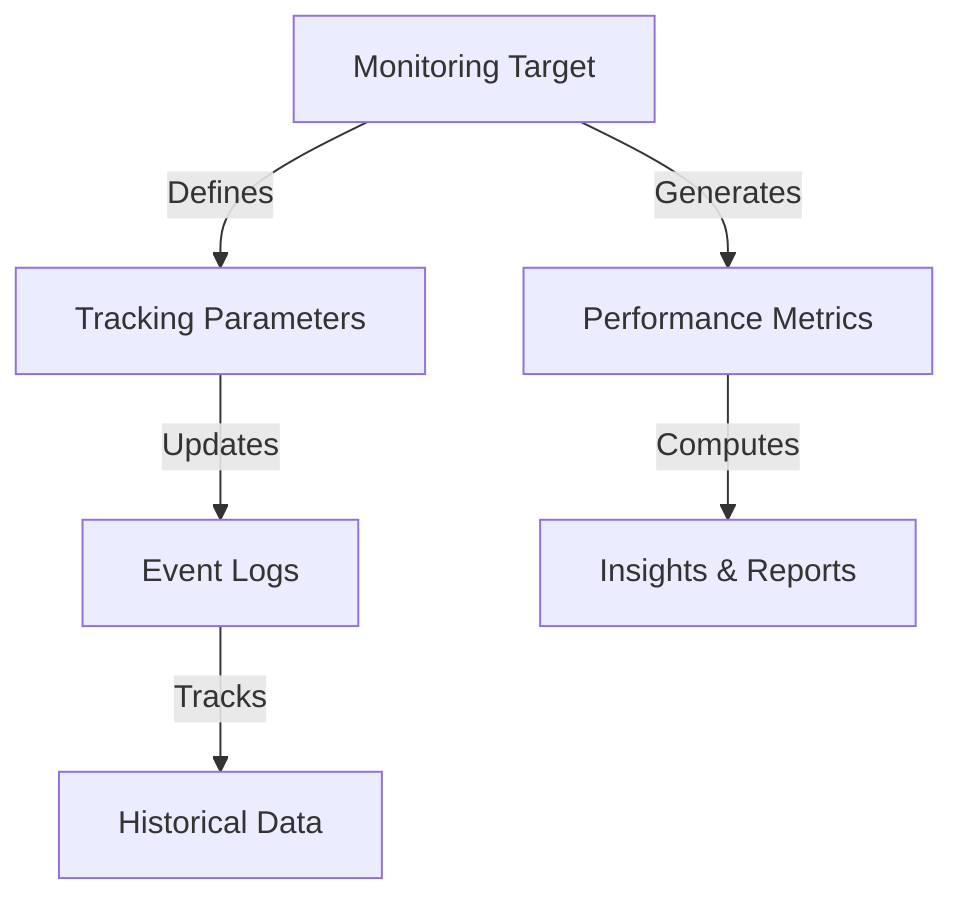

# Base Monitor

A decentralized monitoring and tracking system for blockchain-based activities, providing transparent and verifiable insights into on-chain events and performance metrics.

## Overview

Base Monitor is a smart contract framework designed to track, analyze, and report on critical blockchain activities. By leveraging the Stacks blockchain, this system enables comprehensive monitoring of various on-chain interactions, metrics, and performance indicators.

### Key Features

- Create and manage custom monitoring targets
- Track performance metrics and event frequency
- Generate dynamic reports and insights
- Support for multiple monitoring domains
- Verifiable and transparent tracking mechanism
- Incentive-based reporting system

## Architecture

The system provides a flexible, extensible platform for monitoring blockchain activities through a robust smart contract infrastructure.



### Core Components

1. **Monitoring Targets**: Configurable tracking units for specific blockchain activities
2. **Event Logging**: Transparent and immutable event recording
3. **Metric Computation**: Dynamic calculation of performance indicators
4. **Reporting Mechanisms**: Generation of insights and summaries
5. **Incentive System**: Rewards for accurate and consistent reporting

## Contract Documentation

### Creating Monitoring Targets

```clarity
(create-monitor-target
  name: string-ascii
  description: string-utf8
  category: uint
  tracking-interval: uint
  complexity: uint) -> (response uint uint)
```

### Logging Events

```clarity
(log-event
  target-id: uint
  event-data: (string-utf8 200)
  timestamp: uint) -> (response bool uint)
```

## Getting Started

### Prerequisites

- Clarinet
- Stacks Wallet
- Basic understanding of Clarity smart contracts

### Installation

1. Clone the repository
2. Install dependencies with Clarinet
3. Deploy contract to local, testnet, or mainnet

## Development

### Testing
```bash
clarinet test
```

### Local Development
```bash
clarinet console
```

## Security Considerations

- Immutable event logging
- Transparent metric computation
- Decentralized verification mechanisms
- Robust error handling

## License

MIT License